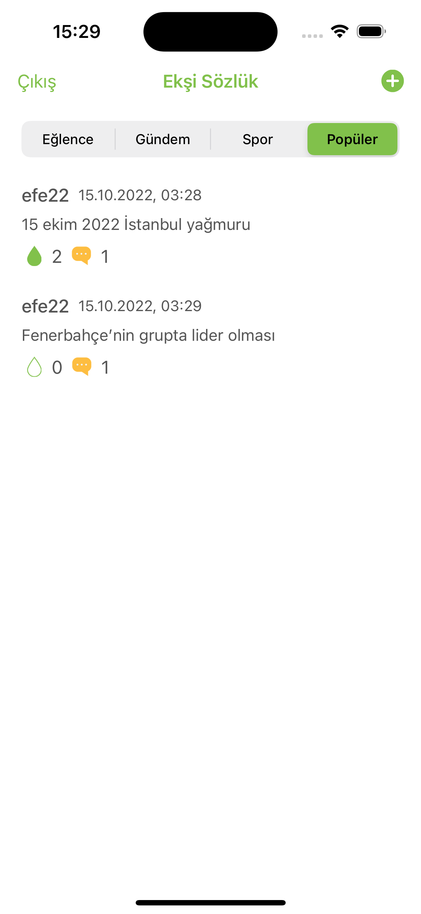

# EksiSozlukApp

this app is a simple sour dictionary app.
users can become a member and open a topic, enter an entry in the opened headings and like the titles.

# Features
* MVC Architecture
* Registration and login feature
* Popular category with the most likes and comments
* Real-time database

# Pods

```yaml
  pod 'Firebase/Core'
  pod 'Firebase/Firestore'
  pod 'Firebase/Auth'
```

# Screens
   
 
